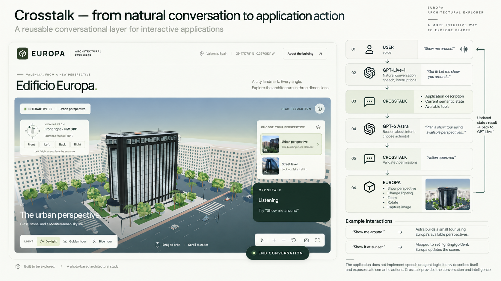

# Crosstalk

Reusable conversational control for Bun web applications. GPT-Live-1 owns speech and turn-taking; GPT-6 Astra reasons over an application's manifest, fresh semantic state and registered tools. Browser audio travels directly to OpenAI over WebRTC. A server sideband receives Live transcripts and delegations; the application WebSocket carries validated state and tool messages.

The first integration is [Edificio Europa](../edificio-europa/README.md). Its nine tools use the same controller as the visible buttons and keyboard controls. The fullscreen tool is retained as an example of browser restrictions on tool execution, rather than a dependable way to enter fullscreen by voice.

Europa's adapter also exposes live spatial state and `show_side` / `orbit_view` tools. Its user-supplied geographic reference defines the entrance as front, facing 010°. The AI receives camera side, compass position, looking direction, elevation, distance and focus offset, including after mouse navigation and during auto-rotation. This is an application-specific extension of the existing state/tool contract; other apps can supply their own spatial model. See the [spatial navigation specification](./specs/europa-spatial-navigation.md).

## From natural conversation to application action

Crosstalk is a reusable conversational layer for interactive applications. The diagram below shows how a spoken request becomes an action in Edificio Europa, and how the result feeds back into the conversation.



1. **The user speaks.** A request such as “Show me around” starts with natural conversation.
2. **GPT-Live-1 handles the conversation.** It manages speech, turn-taking, and interruptions, and delegates requests that need application knowledge or actions.
3. **Crosstalk supplies application context.** It brings together the application's description, fresh semantic state, and available tools so the reasoning model knows what the application can do and what is happening now.
4. **GPT-6 Astra reasons about the request.** It interprets the user's intent and chooses actions using the supplied context—for example, planning a short tour using Europa's available perspectives.
5. **Crosstalk validates the actions and checks permissions.** It checks tool arguments and confirmation requirements before dispatching an action to the application.
6. **Europa executes the action.** Its registered tools can show a perspective, change lighting, zoom, rotate, or capture an image. Tool results and refreshed state feed back through Crosstalk so GPT-Live-1 can explain the outcome and continue the conversation.

For example, “Show me around” asks Astra to build a small tour using Europa's available perspectives. “Show it at sunset” maps to `set_lighting({ lighting: 'golden' })`, and Europa updates the scene.

The application supplies its description, state, and safe semantic actions through an adapter. Crosstalk provides the conversation and reasoning infrastructure, so each application can add conversational control without implementing its own speech or agent logic.

## Browser capabilities limit tools

Exposing an application action as an AI tool does not bypass browser permissions, supported APIs, or user activation requirements. Europa's `set_fullscreen` demonstrates this boundary: native fullscreen entry requires user activation, such as a recent click, which a voice request alone does not provide. A valid tool call can therefore be refused by the browser.

The integration is deliberately kept as a working example of handling that refusal. When entry is blocked for lack of activation, it returns `USER_ACTIVATION_REQUIRED`, shows a message pointing to the fullscreen button, and leaves the reported state consistent with the actual display. The AI must explain the limitation instead of claiming success. Exiting fullscreen does not require a click, and Crosstalk remains accessible while the viewer is fullscreen.

## Run Europa with voice

From the repository root:

```sh
cd cross-talk
bun install
# Create .env from .env.example if you have not already configured it.
cd ../edificio-europa
bun install
bun run dev
```

Open http://localhost:3000 and press **Crosstalk**. Grant microphone access. Try “What am I looking at?”, “Show it at sunset”, “Show me around”, “Go back to the entrance”, or “Save this view”. Use **End conversation** to stop the microphone and voice session.

Europa's `dev` and `start` commands load `../cross-talk/.env`. The key is only read by server code. The current model defaults are:

```env
OPENAI_API_KEY=...
CROSSTALK_LIVE_MODEL=gpt-live-1
CROSSTALK_REASONING_MODEL=gpt-6-astra
CROSSTALK_REASONING_EFFORT=medium
CROSSTALK_VOICE=quartz
CROSSTALK_LOG_TRANSCRIPTS=false
CROSSTALK_DEBUG=false
```

The key must have access to both models. A missing key leaves the explorer usable and reports a voice configuration error when starting a conversation. Microphone access requires localhost or HTTPS. The supplied server binds to `127.0.0.1` by default.

## Embed the server

The local packages expose `@crosstalk/server` and `@crosstalk/client`. Europa links them with Bun `file:` dependencies. Install the `cross-talk` directory's dependencies as well; these development packages use its shared sources. The root package also exports `cross-talk/server`, `cross-talk/client` and `cross-talk/protocol`.

```ts
import { CrosstalkServer, type CrosstalkSocketData } from '@crosstalk/server';

const crosstalk = new CrosstalkServer({
  openAIKey: process.env.OPENAI_API_KEY,
});

Bun.serve<CrosstalkSocketData>({
  hostname: '127.0.0.1',
  port: 3000,
  maxRequestBodySize: 128 * 1024,
  websocket: crosstalk.websocket,
  fetch: crosstalk.handler,
});
```

With an existing Bun server, delegate `/crosstalk/*` requests to `crosstalk.handler(request, server)` and install its WebSocket handlers. Call `await crosstalk.dispose()` on shutdown. See [Europa's server](../edificio-europa/index.ts) for the complete integration.

`bun run dev` in this directory runs a standalone control server on port 3001. For a separate browser origin, set `CROSSTALK_ALLOWED_ORIGINS` to a comma-separated exact origin allow-list and proxy `/crosstalk` through the application's origin. The client defaults to same-origin HTTP and WebSocket traffic.

For a shared deployment, supply `authorize(request)` using the host application's authentication. Origin checks and the per-connection session token prevent cross-origin and cross-tab confusion; they do not authenticate users. `allowedOrigins`, `maxConnections`, `maxToolCalls`, `delegationTimeoutMs`, `logger`, model names and voice are configurable. `liveAdapter` and `astraAgent` support dependency injection for offline tests.

## Register a browser application

```ts
import { CrosstalkClient, type CrosstalkApplication } from '@crosstalk/client';

const application: CrosstalkApplication = {
  manifest, // Identity, concepts, knowledge, limitations and a state JSON Schema.
  getState, // A small semantic snapshot, possibly asynchronous.
  tools,    // Definitions plus browser-local execute handlers.
  subscribe, // Optional semantic change events; returns an unsubscribe function.
};

const client = new CrosstalkClient({ endpoint: '/crosstalk' });
await client.register(application);
client.mountButton({ position: 'bottom-right' });
window.addEventListener('pagehide', () => client.dispose(), { once: true });
```

Tool handlers return serializable data. Crosstalk wraps it in the common success/error envelope. Throw `CrosstalkError` for a specific failure; unexpected errors receive a generic application failure result. Handlers receive an `AbortSignal` and must honor it for interruptible work. Navigation handlers should resolve after their visible transition settles.

Tool inputs must be strict JSON Schema objects (`additionalProperties: false`). Both boundaries validate them. Optional inputs are represented as nullable fields only in Astra's strict function schema, then normalized before application validation. Asynchronous schemas and unresolved references are rejected.

Tools declare an effect (`read`, `navigation`, `mutation`, `external`) and confirmation policy. Astra marks direct user intent separately from tool input. `always` requires an explicit browser approval; `when-not-explicit` requires approval unless the user directly requested that action. The browser checks its own tool metadata and consumes an approval bound to the exact invocation, tool and arguments. Natural-language capability questions are handled by the reasoning prompt, not by keyword routing in the application.

## Execution and lifecycle

- A tab has one registration and a private server-issued token. Starting voice requires that token and a matching application instance.
- Each delegation pulls fresh state. Each successful action pulls state again; semantic events refresh the registry without animation-frame streaming.
- Tools execute sequentially, with a default ceiling of 12 calls per delegation. State requests time out after 2 seconds; navigation after 5 seconds; ordinary tools after 10 seconds; external tools and confirmations after 30 seconds. Delegations default to 120 seconds.
- New intent aborts older model requests, cancels interruptible browser work and discards stale results. Completed effects are not rolled back.
- Pending and completed invocation IDs are cached. Repeated delivery cannot repeat a download. Expiry, cancellation and session checks reject stale work.
- Ending or losing the control connection cancels work and closes voice. The browser re-registers after reconnecting; the user starts a fresh conversation. Stale actions are never replayed.
- Logs contain structured lifecycle, permission, latency and tool-result metadata. Transcripts stay in a bounded in-memory context unless transcript logging is explicitly enabled. Raw audio is neither retained nor logged; Live session storage and Responses storage are disabled.

The supplied clients are for one application registration per page. Server sessions are in memory; durable history, resumable tasks, screen vision, and general remote code execution are outside v1.

## Verify

```sh
# From cross-talk
bun test
bun run typecheck
bun run test:browser

# From edificio-europa
bun test
bun run typecheck
bun run build
```

Install Playwright Chromium with `bunx playwright install chromium`, or set `CHROMIUM_PATH` to an installed Chromium executable. Browser tests use a localhost-only test host and the real WebSocket/router/browser execution path with no model calls. They cover synchronized controls, building/compass sides, relative orbit, live orientation after manual movement and auto-rotation, settled camera transitions, cancellation, confirmation, fullscreen, 4K download and microphone cleanup.

Explicit, billable API checks use the key in `.env`:

```sh
bun run test:astra
bun run test:live
```

The Astra smoke check verifies sunset, entrance and state-question routing. The Live browser checks establish real WebRTC and sideband connections, then inject a short synthetic spoken sunset request to verify the complete Live → Astra → browser action path. `browser/fixtures/sunset.wav` is synthetic speech saying “Show me the building at sunset.” No human microphone recording is used in the tests.

## OpenAI protocol references

The implementation uses the current [GPT-Live WebRTC session API](https://developers.openai.com/api/docs/guides/voice-webrtc?api=live), [client delegation and transcript events](https://developers.openai.com/api/docs/guides/live-delegation), and [server sideband controls](https://developers.openai.com/api/docs/guides/voice-server-controls?api=live). Live session creation uses `POST /v1/live/sessions`, not the older Realtime SDP endpoint referenced in the initial specification. Provider setup, event normalization and commentary encoding are isolated in `src/openai/OpenAILiveAdapter.ts`.
