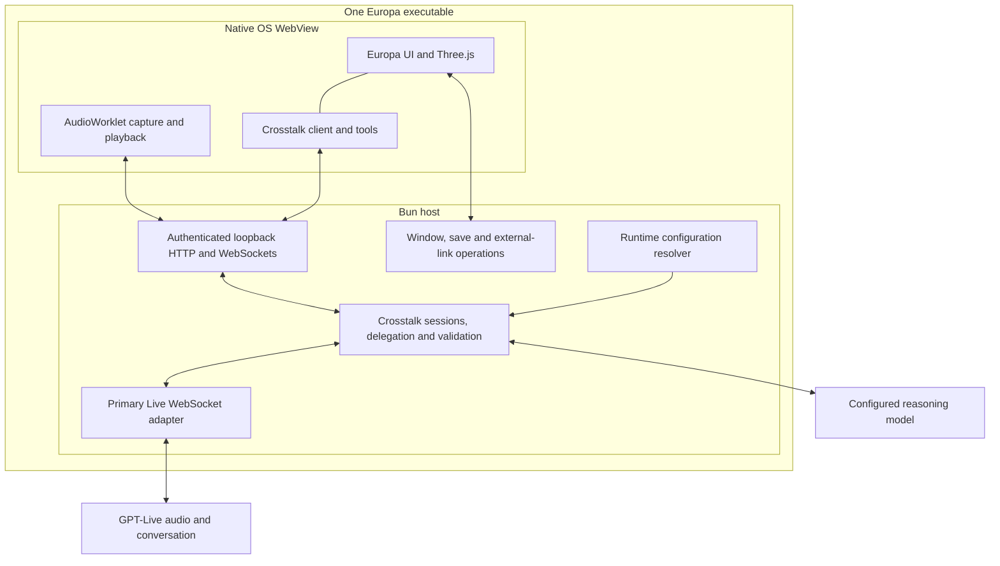

# Edificio Europa: native window and standalone executable

Status: implementation specification. A Linux implementation and executable now exist; see [implementation and verification notes](../docs/native-desktop.md) for completed checks and remaining release gates. The requirements below remain the acceptance contract.

Date: 2026-09-12.

Primary sources: [native-window investigation](../docs/native-window-investigation.md), [single-executable feasibility investigation](../docs/single-executable-feasibility.md), and the current Europa and Crosstalk implementations referenced below.

**Configuration decision:** the shared configuration file is **`$HOME/.conf/crosstalk/crosstalk.cfg`**, using the same dotenv format as the existing `.env` file. This supersedes the earlier investigation's proposed `$HOME/.conf/crosstalk/.env` filename. The directory is `.conf`, not `.config`; the filename is `crosstalk.cfg`, with no embedded backtick or additional trailing dot.

## 1. Purpose and intended outcome

Deliver Edificio Europa as one executable per supported platform that opens its own native window, renders the existing Three.js architectural explorer, and contains the Crosstalk service required for conversational control. The recipient must not need to install Bun, Node.js, a JavaScript dependency tree, or a separate Crosstalk service.

The building remains generated Three.js geometry. Reference photographs are development/reference material, not runtime inputs to the scene, and must not be included in the desktop executable. The desktop interface must remain complete and intentional after its photograph elements are removed.

The native application must support speech input, audible assistant output, semantic state queries, and all nine current Europa tools. Native voice uses a primary GPT-Live WebSocket through the Bun host, with Web Audio capture and playback in the native WebView. It does not depend on `RTCPeerConnection` being available in the operating system's WebView.

The existing browser application remains supported. Its development commands and WebRTC voice path continue to work. Desktop support is an additional delivery mode sharing the scene, application contract, and Crosstalk reasoning and governance logic.

The terms **MUST**, **MUST NOT**, **SHOULD**, and **MAY** below distinguish release requirements, prohibitions, recommendations, and optional implementation choices. Numerical limits are proposed release requirements or measurement targets, not results already demonstrated by the investigation.

## 2. Evidence and remaining uncertainty

The Linux investigation established the following:

| Area | Demonstrated evidence | What remains to be established |
| --- | --- | --- |
| Executable | An 86,078,664-byte native prototype embedded Bun, the addon, UI, and Crosstalk | Repeatable production build, complete relocation and platform acceptance |
| Rendering | Europa rendered a 1196 × 627 canvas without photograph elements | Sustained interaction, resize, display scaling, and production 4K export |
| Crosstalk controls | Registration, golden-hour lighting, and rear-view navigation succeeded through the real protocol and ToolRouter | All nine tools through a live conversation |
| Microphone | A patched binding granted capture permission | Final permission policy, device changes, and macOS behavior |
| Web Audio | AudioContext ran; AudioWorklet received 15,360 samples in a 350 ms probe at 44.1 kHz | Resampling, output scheduling, full-duplex quality, and long-running stability |
| WebRTC | API remained absent despite the setting reading back as enabled | No desktop dependency on this API is permitted |
| Configuration | A compiled synthetic probe preserved environment/local overrides and filled shared defaults | Production loader, dotenv interpolation parity, and actionable diagnostics |
| Live upstream audio | Documentation establishes a primary WebSocket transport | Integrated live input/output, interruption, and cleanup |
| macOS | Crumb documents an arm64 target | This application's full native/audio/release acceptance on macOS |

These findings do not establish a universal inability of WebKit to support WebRTC. They establish that a runtime setting alone did not make it available on the inspected Ubuntu installation. Rebuilding or replacing the system browser engine is outside this implementation's scope.

## 3. Scope and platform contract

### 3.1 Required scope

- **DIST-01:** One launchable application executable per target, containing application code, required frontend assets, Crosstalk implementation, Bun runtime, and target-specific native addon.
- **WIN-01:** One native application window per process; closing it terminates the application and its owned services.
- **VOICE-01:** Desktop conversation through WebSocket audio, retaining the current configured Live and reasoning models.
- **CONFIG-01:** Existing `.env` behavior plus shared defaults from `$HOME/.conf/crosstalk/crosstalk.cfg`.
- **UI-01:** Complete explorer UI without bundled reference photographs or required runtime requests for fonts/scripts/styles.
- **COMPAT-01:** Existing browser development, static build, browser voice, and application tools retain their established behavior.

### 3.2 Supported targets

| Target | Requirement |
| --- | --- |
| Linux x64 | First implementation and release gate; native Wayland; documented GTK/WebKitGTK runtime baseline |
| macOS arm64 | Intended second target; build and validate on Apple Silicon; full acceptance required before publishing a supported artifact |
| Windows, Intel macOS, Linux X11/XWayland | Out of scope for this specification |

A Linux-only first release is acceptable if it is explicitly labeled as such. A successful Linux build must not be represented as macOS support. Each published target must meet its own release gates.

“Single executable” describes the delivered application artifact. It does not mean static linkage of all operating system libraries, absence of WebKit helper processes, offline AI inference, or prohibition on user-selected export files. Runtime extraction of an embedded native addon is acceptable if handled by the runtime without requiring an adjacent user-managed addon or source checkout.

The application may require supported OS WebView/audio libraries. It must document these dependencies and fail clearly when they are unavailable. It must not silently install or replace system libraries on launch.

### 3.3 Non-goals

The initial implementation excludes a bundled Chromium engine, custom WebKit distribution, global Crosstalk daemon, multi-user server, multiple application windows in one process, account management, automatic updates, model migration, cloud credential provisioning, and an installer. Signing/notarization or an application bundle may become necessary for a particular distribution channel; that must be specified and validated separately rather than hidden in a “single-file” claim.

## 4. Chosen architecture



The Bun process owns both the loopback service and native window. There is no child Bun server, shell launcher, external server executable, or connection to an independently running Crosstalk daemon. Sharing `crosstalk.cfg` between apps shares configuration only, not sessions, sockets, or application state.

The loopback service serves embedded HTML, browser JavaScript, CSS, font assets, and AudioWorklet modules. The window loads its HTTP origin. Keeping the UI and Crosstalk endpoints on that exact origin avoids a cross-origin migration of the current protocol.

This is a deliberate network-capable adaptation of Crumb. Stock Crumb's no-listener/no-network document architecture is not an invariant of this desktop app. The adaptation must be explicit and isolated; it must not silently relax the defaults of unrelated Crumb applications.

### 4.1 Ownership and code boundaries

| Owner | Responsibilities |
| --- | --- |
| Europa shared application | Geometry, camera, lighting, semantic state, nine tools, shared UI behavior |
| Europa desktop entry | Native launch, embedded assets, display/export adapters, lifecycle and diagnostics |
| Crosstalk shared core | Registration, session ownership, permission checks, reasoning, delegation, confirmation, validation, cancellation |
| Crosstalk desktop transport | Local audio protocol, primary upstream WebSocket, audio-specific lifecycle |
| Crosstalk browser transport | Existing WebRTC offer/answer and sideband behavior |
| Crumb-derived native layer | Window creation, trusted-page bridge, media permission handling, native operations |

The target project must contain or consume a pinned, reproducible copy of the required Crumb machinery. Builds and releases must not reference `/home/iwk/src/crumb`, investigation `/tmp` directories, or their cached addon binaries. The existing sibling Crosstalk packages may remain build-time monorepo dependencies; they must be bundled into the executable rather than resolved from a sibling checkout at runtime.

## 5. Launch, origin, and process lifecycle

### 5.1 Startup sequence

1. Resolve normal Bun startup environment and shared Crosstalk configuration before constructing `CrosstalkServer` or any upstream client.
2. Validate the platform and load the pinned native addon. Validate the Wayland requirement on Linux.
3. Construct a desktop host with an idempotent shutdown coordinator. Register cleanup as resources are acquired.
4. Bind `Bun.serve` to `127.0.0.1` with port `0`, obtaining a free port from the OS. Native mode must not inherit the browser server's `HOST` or `PORT` settings in a way that exposes it on a LAN.
5. Generate a per-launch authentication capability, install embedded asset routes, and configure the exact resulting origin in Crosstalk and the native bridge.
6. Open the native window at the authenticated bootstrap URL. Display the existing loading UI until the scene is ready.
7. Complete Crosstalk application registration. Scene readiness and conversation readiness are distinct; the explorer remains usable if voice is unavailable.
8. Request microphone access only when the user starts a conversation. Merely launching the executable must not start capture or an upstream voice session.

If native initialization fails after the listener starts, stop the listener. If the listener fails, do not leave an empty native window or a background process behind.

### 5.2 Loopback access control

- **LOCAL-01:** Bind exclusively to loopback; validate the request's Host against the selected address and port, and validate Origin on control/session/audio endpoints.
- **LOCAL-02:** Require a launch capability in addition to relying on loopback or Origin. A random port is not authentication.
- **LOCAL-03:** Establish a per-launch HTTP-only session cookie using a single-use, short-lived bootstrap capability with at least 256 bits of cryptographic randomness. A bootstrap route may exchange that capability for the cookie and redirect to `/`. Do not log the capability-bearing URL; set `Referrer-Policy: no-referrer` and avoid third-party resources.
- **LOCAL-04:** Use `SameSite=Strict` and `Path=/`; do not rely on a `Secure` cookie being sent over plain loopback HTTP. Scope the capability to the process lifetime and revoke it on shutdown.
- **LOCAL-05:** Protect UI, worklet, and host-operation routes after bootstrap. Preserve Crosstalk's separate control-session token and application-instance binding for audio authorization.
- **LOCAL-06:** Reject null, foreign, malformed, or mismatched Origins on WebSocket and state-changing HTTP requests. Do not enable wildcard CORS or reflect arbitrary origins.

An equivalent native bootstrap mechanism may replace the cookie exchange if it provides the same properties and is supported by the actual binding. This does not attempt to isolate secrets from a malicious process already running as the same OS user; the practical boundary is unintended browser/origin access to the local service.

### 5.3 Multiple launches

Independent launches may create independent native processes, windows, free ports, and sessions. One launch must never attach to another launch's application instance or terminate its services. A later single-instance UX is optional and must not be implemented by weakening capability checks.

### 5.4 Shutdown

All exit paths converge on one idempotent coordinator: window close, SIGINT, SIGTERM, startup failure, fatal host failure, and programmatic exit.

On shutdown:

1. Mark the host closing; reject new sessions, audio starts, and native operations.
2. Cancel reasoning, pending tools, pending confirmations, and export transactions.
3. Stop microphone tracks, detach worklets, flush queued audio, and close AudioContexts when the page is still reachable.
4. Send an upstream session-close request for any active voice session and wait only within the shared shutdown deadline.
5. Close local audio/control sockets, unregister the app, stop the listener, release the window, and exit.

Use a **single total deadline of 3 seconds**, matching Crumb's current shutdown budget. Do not stack independent 3-second waits into an unbounded sequence. Perform the necessary cancellations immediately even if an earlier asynchronous cleanup task stalls. Repeated close events must not resend effects or recreate resources.

The host cannot rely on `pagehide`, a successful bridge call, or a final server event to release its resources. Upstream disconnection and a crashed WebView must be covered. Logs must distinguish graceful completion from deadline expiry without including credentials or audio.

## 6. Native window and application behavior

### 6.1 Rendering and navigation

The window must be resizable, start at a useful desktop size, and support the existing responsive layout, keyboard controls, orbit/pan/zoom, presets, lighting, automatic rotation, compass, building-side navigation, dialogs, and semantic state updates. Use the current application's labels and domain semantics.

Preserve user-supplied orientation: front 010°, back 190°, left 100°, right 280°. Camera position and looking direction remain distinct. Moving the camera must not create claims of guaranteed feature visibility. Transitions resolve only after settling and respect cancellation.

Photograph-backed cards must become complete text/icon or model-derived controls. Remove photograph requests from the desktop UI and About content; do not leave broken image icons, empty reserved photo areas, or requests that quietly return 404. The source reference photographs may remain in the repository for development.

All desktop fonts must be bundled with appropriate licenses, or the desktop design must deliberately use system fallbacks. The native build must not fetch Google Fonts or other remote presentation assets. No network is needed to launch and use the manual explorer.

### 6.2 Display and host-operation adapters

Introduce narrow platform interfaces so scene/controller code does not depend directly on a particular native binding. Browser adapters continue to use browser APIs. Desktop adapters expose only validated operations needed by this app; do not expose a generic filesystem, shell, arbitrary JavaScript evaluation, or unrestricted URL-opening bridge to the page.

Required operation concepts are:

| Operation | Input and result contract |
| --- | --- |
| Fullscreen | Boolean desired state; result based on observed native state; push changes from OS controls back to the controller |
| PNG save | One bounded image transfer and proposed basename; user selects destination in a native save dialog; success only after write completes |
| External location link | A fixed application link identifier; host resolves the predefined HTTPS Maps URL and opens the system browser |
| Diagnostics | Non-secret capabilities and configuration provenance; no raw environment dump |

The bootstrap's IPC trust list must contain the exact origin with its selected port. Release developer tools must be disabled in the host launch path and must not be re-enabled by page configuration, `.env`, or `crosstalk.cfg`.

### 6.3 Fullscreen

Desktop fullscreen should use a native window operation if the binding supports reliable state observation. If a binding extension is required, include it in the pinned native build. Browser mode retains the DOM fullscreen adapter and its `USER_ACTIVATION_REQUIRED` behavior.

Entering/exiting fullscreen, Escape, and OS-originated changes must update the same controller state. The Crosstalk controls remain visible and usable. Do not report success solely because a setter returned; observe the final state or return an actionable unsupported/failed result. Update desktop manifest guidance so it does not assert a browser-only activation constraint when the native operation has no such constraint.

### 6.4 4K PNG export

Retain 3840 × 2160 output and restoration of renderer size, pixel ratio, camera projection, and any view offset after success, cancellation, or failure.

The desktop save flow must await completion. Refactor the current synchronous `capture()`/`capture_view` path as needed so a tool result cannot claim a file was saved when a dialog was canceled or a write failed. Preserve the existing external-effect classification and `when-not-explicit` confirmation policy.

Do not pass an arbitrary destination path from the reasoning model into a filesystem write. The native dialog supplies the destination. Overwrite handling must be explicit through the dialog. Associate a save with its invocation/transaction ID so retries or duplicate messages cannot write the same effect twice.

Bound one export to 32 MiB of encoded PNG data. If the bridge transports image data, use chunks of at most 256 KiB and enforce a total-size/deadline limit; do not send an oversized base64 message through the binding's current 10 MB IPC limit or raise unrelated Crosstalk control limits to accommodate it. Validate PNG signature and dimensions before finalizing the write. Clean up partial transfers and temporary files on cancellation.

## 7. Crosstalk compatibility and transport separation

Current integration points are [`CrosstalkClient`](../../cross-talk/src/client/CrosstalkClient.ts), [`LiveTransport`](../../cross-talk/src/client/LiveTransport.ts), [`CrosstalkServer`](../../cross-talk/src/server/CrosstalkServer.ts), [`SessionManager`](../../cross-talk/src/server/SessionManager.ts), and [`OpenAILiveAdapter`](../../cross-talk/src/openai/OpenAILiveAdapter.ts).

The current `connect(sdp, ...)` / `start(app, offer)` contract assumes WebRTC. Replace that assumption with a discriminated internal session request, such as `webrtc` with an SDP offer or `pcm-websocket` with a validated format and local audio sink. Keep adapter-specific fields inside their transport branch. Do not pass an empty or fabricated SDP to represent desktop audio.

The core must retain:

- Application registration and state-schema validation.
- Session/token/instance ownership checks.
- Strict tool schemas, permissions, explicit-intent checks, confirmations, and duplicate-effect protection.
- Fresh state retrieval before reasoning and after successful actions where currently required.
- Sequential actions within delegations and cancellation when superseded.
- Timestamped transcript handling and delegation context selection.
- Normalized errors and complete cleanup on disconnect.

Desktop transport is selected by trusted desktop bootstrap configuration, not by a page-supplied API key or guessed user agent. Keep browser WebRTC as the browser default. The established `/crosstalk/ws` and `/crosstalk/live/session` WebRTC behavior must remain compatible.

Version the new audio protocol independently as `desktop-audio/1`. The desktop client and host must explicitly agree on it. Do not silently change the existing control protocol's meaning. If optional capabilities are added to `server.hello`, old clients must remain accepted and new desktop clients must fail clearly when the required capability is absent.

## 8. Primary GPT-Live WebSocket adapter

The host uses the documented primary WebSocket flow, not an SDP-creation call followed by a sideband attach. See [official GPT-Live WebSocket documentation](https://developers.openai.com/api/docs/guides/voice-websockets).

Required behavior:

1. Authenticate from the Bun host using the resolved API key. Never send that key to HTML, browser JavaScript, AudioWorklet, native bridge responses, logs, or the local audio protocol.
2. Open the documented primary endpoint and send `session.start` once with the configured model, voice, current conversation instructions, audio format, client delegation, and `store: false`.
3. Wait for `session.started` before accepting microphone data for upstream transmission or declaring the conversation ready. Do not reuse WebRTC-only data-channel configuration fields.
4. Translate input PCM frames into `session.input_audio.append` messages. Decode `session.output_audio.delta` into bounded output frames for the native client.
5. Normalize transcript, delegation, commentary acknowledgment, close, and error events into the existing Crosstalk event model.
6. Send commentary over this primary connection; do not create a redundant sideband connection in desktop mode.
7. Keep `session.close`, disconnect, timeout, and abort handling idempotent and bounded.

Preserve the current defaults: `gpt-live-1`, `gpt-6-astra`, reasoning effort `medium`, and voice `quartz`. These are application configuration defaults, not a guarantee of model access for every credential. Invalid model/voice access must result in a useful voice error while the explorer remains usable.

Use Bun's native WebSocket API where practical. If an SDK wrapper is selected, verify its runtime dependencies and standalone bundling; do not assume an SDK wrapper that imports `ws` is dependency-free merely because Bun has a global WebSocket.

No unconditional automatic retry may recreate an ambiguous or billable session. On loss of an established upstream connection, stop capture/playback and require a fresh conversation start. Reconnecting the idle local control connection may retain its existing behavior, but it must not silently resume a microphone session.

## 9. Local desktop audio protocol

### 9.1 Dedicated channel and authorization

Use a dedicated same-origin WebSocket, provisionally `/crosstalk/audio`, for audio. Do not feed PCM or audio JSON into the existing control router's 100-messages-per-second path.

The HTTP upgrade requires the launch cookie and exact Origin. Within 5 seconds of upgrade, the client must send `audio.hello` with protocol `desktop-audio/1`, the registered application instance ID, its control-session ID, and the token issued on that control connection. Browser WebSocket cannot supply an arbitrary Authorization header, so authenticate in this bounded first message after the HTTP upgrade.

The host verifies all fields against an active registered control socket. Allow at most one authenticated audio channel per control session and one active voice generation on it. Reject expired, reused, mismatched, or disconnected ownership. Audio must not begin merely because `audio.hello` succeeds.

Closing the owning control socket invalidates its audio channel. The host must not accept an application ID or instance ID alone as authorization.

### 9.2 Control messages

The exact implementation schemas must be checked in alongside the protocol. The following message semantics are required:

| Direction | Message | Meaning |
| --- | --- | --- |
| Client → host | `audio.hello` | Authenticate and negotiate protocol |
| Host → client | `audio.authenticated` | Channel is bound to the registered control session |
| Client → host | `audio.start` | Request a conversation after user gesture, local audio readiness, and microphone permission |
| Host → client | `audio.starting` | Allocate a host-owned generation; upstream start is in progress |
| Host → client | `audio.started` | Upstream ready; generation and fixed PCM format confirmed |
| Either direction | `audio.stop` / `audio.stopped` | End the generation; idempotent acknowledgment |
| Host → client | `audio.flush` | Invalidate queued playback for an explicitly identified output epoch |
| Host → client | `audio.error` | Stable error code, recoverability, and non-secret user-facing message |

Validate object shape, string lengths, identifiers, state transitions, and message size. Unknown messages or binary data before readiness must not reach the upstream adapter. Never expose arbitrary upstream commands through the audio channel; the host owns the allowed event mapping.

### 9.3 Binary frame contract

The initial desktop format is mono signed PCM16 little-endian at 24,000 samples/second in both directions. Capture should normally be transmitted in 20 ms frames: 480 samples and 960 payload bytes. Upstream chunks may be split into local frames of at most 100 ms.

Use a fixed 20-byte binary header followed by PCM samples:

| Byte offset | Type | Field |
| --- | --- | --- |
| 0 | uint8 | Version, `1` |
| 1 | uint8 | Kind: `1` capture, `2` playback |
| 2 | uint16 LE | Reserved flags, zero in version 1 |
| 4 | uint32 LE | Host-assigned voice generation |
| 8 | uint32 LE | Playback epoch; zero for capture |
| 12 | uint32 LE | Sequence number, increasing within direction/generation/epoch |
| 16 | uint32 LE | Sample count |
| 20 | bytes | Exactly `sampleCount × 2` PCM bytes |

Reject zero/oversized counts, odd/truncated payloads, unknown kinds/flags, unexpected sequence numbers, or a capture epoch other than zero. Maximum frame size is 4,820 bytes for 100 ms of audio. Old-generation or invalidated-epoch playback must be discarded without playing it. Counter exhaustion starts a fresh authenticated session rather than wrapping into a live identifier.

This is an internal application protocol, not a representation of OpenAI's wire format. Base64 encoding belongs only at the upstream adapter boundary where required.

### 9.4 Limits and backpressure

| Resource | Initial bound |
| --- | --- |
| Audio handshake | 5 seconds |
| Upstream ready deadline | 15 seconds, excluding time the user spends answering a native permission prompt |
| JSON audio control message | 16 KiB |
| Input cadence | Normally 50 frames/second; at most 100 frames/second with bounded burst allowance |
| Pending microphone audio | 250 ms per stage; no seconds-long hidden backlog |
| Scheduled playback lead | Target 40–100 ms; hard maximum 500 ms |
| PCM output waiting at host or client | 500 ms per stage |
| Active voice | One generation per registered desktop application instance |

Track queued audio duration as well as bytes. Monitor WebSocket `bufferedAmount` and the worklet/playback queue. Control stop/cancel signals must not be blocked behind an unbounded audio queue.

If a sustained stall exceeds a bound, end that voice generation with a recoverable audio/network error and clear its queues. Do not play many seconds of stale speech later, silently drop arbitrary audio while claiming normal operation, or allocate memory without a ceiling. Short startup priming is allowed within the playback bounds.

Rate limits must allow legitimate 20 ms framing plus normal stop/status traffic. Tests must cover that cadence; copying the control socket's current rate limiter unchanged is insufficient.

## 10. Capture, conversion, playback, and interruption

### 10.1 Capture

Create/resume AudioContext and request microphone capture in the Start Conversation gesture path. Capture audio only, requesting echo cancellation and noise suppression where supported. Inspect the actual sample rate; do not assume a requested rate was honored. The investigation observed 44.1 kHz.

Use an AudioWorklet for real-time sample handling. Worklet callbacks must not perform network I/O, base64 conversion, expensive allocation per sample, or blocking operations. Pass bounded sample buffers to the page/transport. Embed the worklet as an ordinary same-origin asset rather than fetching a source path from the repository.

The capture graph must never connect audible microphone monitoring to the speakers. A graph used to keep processing active must produce silence at its destination. No microphone data is retained before upstream readiness beyond the stated bound; discard untransmitted startup samples instead of replaying a pre-conversation backlog.

### 10.2 PCM conversion

Implement continuous resampling from actual input rate to 24 kHz with state maintained across chunk boundaries. Support at least 44.1 kHz and 48 kHz input. Use an anti-aliasing method suitable for speech; simple sample dropping without filtering is not sufficient.

Define downmixing, clipping to signed 16-bit range, little-endian packing, NaN/non-finite handling, and fractional phase carry explicitly. The converter must preserve duration over long streams without repeated frame-boundary drift. Flush or discard the final partial frame consistently on stop; never join samples from different generations.

Test known synthetic signals and long-duration sample accounting. Quality/latency measurements must include conversion cost under active Three.js rendering.

### 10.3 Playback

Decode upstream audio in the host, validate the agreed format, and send bounded PCM frames to the native client. The client converts to its actual output rate and feeds a continuous worklet/ring buffer or equivalently bounded scheduler. Never create one independent HTMLAudioElement per chunk.

Handle underruns with silence rather than stale buffer reuse. Expose prolonged underrun/blocked playback as a recoverable state. If user activation is required to resume audio, show a direct “Enable audio” control; do not claim the assistant was audible.

Speaker activity and microphone capture must coexist. Do not stop capture whenever assistant output arrives. Validate echo behavior on headphones and built-in speakers; avoid feedback and accidental microphone monitoring.

### 10.4 Interruptions and stale work

Voice generation, playback epoch, delegation ID, and tool invocation ID are separate identities. A new conversation invalidates all audio from the old generation. An output invalidation advances only playback epoch, not the microphone stream's generation.

Map only documented upstream output-invalidation semantics to `audio.flush`. Do not invent an upstream event or treat every transcript delta as an instruction to discard audio. If the current Live protocol uses a continuous stream without a separate invalidation event, preserve that stream and bound playback lead; record and test how interruptions are rendered.

Crosstalk must continue canceling superseded reasoning/actions and suppressing late commentary from obsolete delegations. A local Stop or window close immediately stops capture and flushes playback without waiting for an upstream acknowledgment. Test speaking over the assistant, changing intent during navigation, Stop during startup, and repeated start/stop.

## 11. Native media permissions

Replace the diagnostic patch with a maintained, pinned Linux patch that actually enforces the application's audio permission setting. Merely exposing `allowMicrophone` or printing the original warning does not meet the requirement.

Permission handling must:

- Grant audio only when the host enabled it for this app and the requesting content belongs to the trusted application context.
- Reject camera capture and unrelated permission requests unless separately required and specified.
- Respect OS denial and device unavailability; never silently choose a permissive fallback.
- Restrict navigation and frames so checking only a top-level URL cannot accidentally grant an untrusted subframe microphone access. Where the native API exposes request-origin information, validate it; where it does not, forbid untrusted frames entirely.
- Request capture from the visible conversation control and clearly display listening/connecting state.
- Stop capture on conversation termination, lost ownership, WebView destruction, and process shutdown.

The native mode does not need WebRTC enabled once it uses the PCM transport. Do not ship an unnecessary experimental flag merely because it was used in a diagnostic probe.

On macOS, establish the required microphone usage metadata, launch identity, and user-consent flow. A raw command-line executable launched from a terminal is not adequate evidence for file-manager launch behavior. If a supported distribution requires a bundle or different metadata embedding, document the artifact contract and resolve it before publishing that target.

## 12. Runtime configuration

### 12.1 Canonical path and format

The shared file is exactly:

```text
$HOME/.conf/crosstalk/crosstalk.cfg
```

Resolve the actual user's home directory with an OS API such as `os.homedir()`, then append `.conf/crosstalk/crosstalk.cfg`. Do not resolve the file relative to the current working directory, executable directory, source repository, or build host. No literal `$HOME` substring is used as a filesystem directory name.

The file is **dotenv text**, despite its `.cfg` extension. It is not INI, JSON, TOML, YAML, or a shell script. It supports the same syntax and expansion behavior as the project's supported Bun `.env` reader.

Example, containing placeholders only:

```dotenv
# Shared defaults for local Crosstalk applications.
OPENAI_API_KEY=replace-with-your-key
CROSSTALK_LIVE_MODEL=gpt-live-1
CROSSTALK_REASONING_MODEL=gpt-6-astra
CROSSTALK_REASONING_EFFORT=medium
CROSSTALK_VOICE=quartz
CROSSTALK_LOG_TRANSCRIPTS=false
```

The app must not create a file containing a placeholder API key automatically. A distributable example file may be supplied as documentation, but no config file is required beside the executable.

### 12.2 Precedence

| Priority | Source | Rule |
| --- | --- | --- |
| 1, highest | Environment supplied by shell/launcher | Existing values win |
| 2 | Existing app-specific Bun dotenv loading | Preserve normal Bun behavior and current explicit development `--env-file` selection |
| 3 | `$HOME/.conf/crosstalk/crosstalk.cfg` | Fill missing Crosstalk settings only |
| 4 | Application defaults | Apply only where no higher source supplies a value |

Continue using the current browser commands with `bun --env-file=../cross-talk/.env ...`. The desktop development command may use the same explicit file. The installed executable must not depend on that repository-relative path.

Enable `compile.autoloadDotenv` for the desktop release, overriding Crumb's current `false` setting deliberately. Preserve Bun's working-directory `.env`, mode-specific, and `.env.local` behavior. Keep runtime bunfig and source-config autoload disabled unless separately justified; enabling dotenv is not a reason to load an arbitrary build configuration.

The shared resolver runs after Bun startup loading and before Crosstalk construction. Do not overwrite a higher-priority setting because its value is an empty string: presence and absence are different. An explicitly empty API key disables voice rather than falling back to a shared key. Validate other empty values according to their setting and report invalid configuration instead of silently masking it.

For direct programmatic library use, explicit `CrosstalkServerOptions` retain precedence over environmental configuration. Prefer passing a resolved configuration object into the desktop server rather than leaking shared helper variables into unrelated process configuration.

The initial release need not support Bun's `--env-file` flag as a command-line option on the compiled app itself. Do not advertise that option unless the compiled executable's behavior has been explicitly implemented and tested. Existing Bun development invocations remain supported.

### 12.3 Dotenv compatibility

**CONFIG-02:** The `.cfg` extension must not change parsing semantics. A byte-identical file accepted as `.env` by the supported Bun version must be interpreted equivalently when used as shared defaults, subject only to the declared source precedence and supported-setting boundary.

The compatibility test corpus must cover comments, whitespace, CRLF, supported quote forms, empty assignments, duplicate assignments, escaped dollar signs, `$VARIABLE` interpolation, supported multiline values, and malformed input. Check any additional supported interpolation syntax against the actual pinned Bun reader rather than assuming shell semantics.

Do not use `process.loadEnvFile()` alone and claim parity: the investigation showed that it preserved literal `$VARIABLE` references where Bun's startup reader expands them. Use a compatible parser/expansion implementation and differential fixtures against Bun. Evaluate references with higher-priority environment values visible and shared-file definitions following the selected Bun reader's rules.

Parsing must never execute shell commands, command substitutions, JavaScript, or config-file contents. Dotenv backtick quoting, if supported by Bun, is quoting rather than permission to invoke a shell.

### 12.4 Supported settings and validation

| Setting | Default | Validation / use |
| --- | --- | --- |
| `OPENAI_API_KEY` | Absent | Host-only credential; absence/explicit empty disables voice |
| `CROSSTALK_LIVE_MODEL` | `gpt-live-1` | Nonempty model identifier; actual access checked on voice start |
| `CROSSTALK_REASONING_MODEL` | `gpt-6-astra` | Nonempty model identifier |
| `CROSSTALK_REASONING_EFFORT` | `medium` | `low`, `medium`, or `high` |
| `CROSSTALK_VOICE` | `quartz` | Nonempty voice identifier; do not claim access without upstream acceptance |
| `CROSSTALK_LOG_TRANSCRIPTS` | `false` | Explicit boolean; opt-in only |
| `CROSSTALK_DEBUG` | `false` | Sanitized host diagnostics; never enables native devtools or secret/audio logging |

Shared files may contain helper assignments for dotenv expansion, but only supported Crosstalk settings enter the resolved server configuration. Unknown `CROSSTALK_` keys should produce a warning naming the key, not its value. Shared config must not control native listener exposure, arbitrary filesystem paths, executable loading, or shell commands.

There is no hot reload in the initial release. Configuration is a startup snapshot; explain that changes take effect after restart. Two local apps read the same file independently and retain their own sessions.

### 12.5 Missing and invalid configuration

- Missing shared file or directory is normal; continue with higher-priority values/defaults.
- Missing key leaves the explorer fully usable and makes Start Conversation show a concise setup message identifying `.env` and the canonical shared file.
- An unreadable, oversized, or malformed shared file must not be silently ignored. Report the path and safe error category, with line/key location where available, without dumping values or source lines containing secrets. Bound the file to 64 KiB.
- Voice-specific validation failure disables voice with an actionable message rather than crashing the scene. Do not partially apply a malformed shared file.
- Never copy a development key into the executable, browser bundle, example config, diagnostics, test fixtures, or source control.
- If a future user-facing setup flow writes this file, it must use restrictive permissions and atomic replacement. Such an editor is not required by this specification, and implementation must not overwrite existing user configuration automatically.

## 13. User-visible conversation and error states

Keep the current conversation panel and familiar controls. The UI should describe the user's state, not implementation internals such as PCM frames or native bindings.

| State | Behavior |
| --- | --- |
| Explorer loading | Show progress/loading treatment; no microphone capture |
| Explorer ready, voice unconfigured | Full manual use; clear setup guidance when voice is requested |
| Connecting | Indicate progress; Stop remains available; permission prompt may be outstanding |
| Listening | Microphone active and upstream ready |
| Speaking | Assistant output scheduled/playing; microphone can remain active |
| Audio blocked | Offer a user gesture to enable playback; do not claim audible success |
| Recoverable error | Stop capture/playback; describe the issue and offer retry |
| Stopping / closing | Disable new starts and actions; finish bounded cleanup |

Normalize at least configuration unavailable/invalid, unsupported capture API, permission denied, no microphone, blocked playback, device lost, local connection lost, upstream authentication/model failure, startup timeout, audio overrun, save canceled, and save failed. Preserve existing tool error semantics where appropriate.

Do not show “listening” merely because a microphone stream exists before upstream readiness. Do not claim an action completed while its camera transition, native state change, confirmation, or file write is pending.

## 14. Embedded assets, build, and dependency policy

### 14.1 Build contents

The release build must explicitly embed:

- Production host entry and required Crosstalk dependencies.
- Europa HTML, browser code, styles, selected font assets, and AudioWorklet code.
- Pinned target-specific native addon through a statically discoverable import/require path.
- Any application-owned native extension needed for supported display/save operations.

It must exclude reference photographs, `.env` files, `crosstalk.cfg`, credentials, test-only endpoints, probe scripts, development source maps, temporary paths, HMR code, and runtime source-checkout lookups.

Do not use build-time blanket environment substitution. Only explicit non-secret UI constants may be inlined. The API key is always resolved at runtime.

The desktop UI build must handle HTML replacement or asset manifests safely. Do not use replacement strings that interpret `$&` and similar replacement tokens inside generated JavaScript; prefer callbacks or a build pipeline that preserves generated bytes.

### 14.2 Native build provenance

Pin the upstream native source revision and archive digest, apply the existing Wayland patch and the maintained permission/host-operation changes reproducibly, and fail if checksums or patches do not match. Do not silently fall back to an unpatched published Linux addon or an investigation cache.

The build must invalidate stale cached addons when source, patches, target, or declared build inputs change. Record Bun version, native source revision, patches, target architecture, and relevant native dependency baseline with the release. Include applicable licenses.

Build each release on its target OS. Inspect linked libraries and report missing/non-system dependencies. Validate the oldest declared runtime baseline, not just the developer workstation.

### 14.3 Commands and file layout

Preserve current `dev`, `start`, `build`, and `typecheck` behavior. Add distinct desktop commands, provisionally:

```text
dev:desktop       Build/load native host and run Europa's desktop mode
build:desktop     Produce the platform executable
test:desktop      Offline desktop transport/config/native integration checks
test:desktop:live Opt-in billable voice acceptance
```

Suggested target filenames are `dist/edificio-europa-linux-x64` and `dist/edificio-europa-macos-arm64`. Do not overwrite the existing static `dist` assets accidentally; use clear output subdirectories or dedicated output paths.

A proposed organization is `desktop/` for the host/bootstrap/platform adapters, `scripts/` for production build/verification, a project-local Crumb kit/native patch area, and shared desktop audio/config modules under Crosstalk. Exact filenames may follow the repository's conventions, but responsibilities and compatibility boundaries above are required.

The `.ts.txt` files in the investigation docs are evidence, not production modules. Do not add absolute `/tmp` imports from them to the app or change tsconfig to hide resulting errors.

## 15. Content policy, local routes, and diagnostics

Serve a production Content Security Policy allowing only the exact resources required: same-origin scripts/styles/fonts/assets/worklets, the application's loopback WebSocket endpoints, and narrowly required media sources. Forbid untrusted frames, object embedding, arbitrary navigation, remote scripts, and `unsafe-eval`. Hash/nonced inline content may be used if the build requires it; do not simply remove CSP to make the prototype work.

All upstream requests originate in the host. The page does not need direct OpenAI network access. If a browser-specific WebRTC mode has different CSP requirements, configure it independently.

Keep existing control payload limits and validation. Audio and PNG transfer have their own limits; increasing a global request limit must not bypass endpoint-specific checks. Static routing must use an embedded asset map and must not become a generic filesystem server.

Diagnostics may include app/build version, OS/architecture, native runtime versions, chosen loopback port, capability results, voice state, queue durations, resampling rates, and configuration source names. They must not include API keys, tokens, bootstrap URLs, audio samples/base64, full config contents, or transcripts unless the existing transcript opt-in is explicitly enabled. Even opted-in transcript logging does not permit key or raw-audio logging.

## 16. Performance and resilience targets

These are initial measurement targets on the documented reference machine, not guarantees for every device or network:

- Native window and usable scene within 5 seconds on a warm launch, excluding OS permission prompts.
- No capture/playback work in the main UI thread that visibly stalls navigation.
- Continuous 20-minute conversation with bounded memory and no steadily growing audio queue.
- No queued microphone/playback audio surviving Stop or generation change.
- Local Stop invalidates capture/playback within 100 ms under normal load; total process close remains within the 3-second deadline.
- Export may be slower than normal rendering but must restore the interactive scene and not corrupt audio/session state.

Record launch time, artifact size, memory before/after repeated sessions, input/output queue occupancy, underruns, resampler duration error, and local audio pipeline latency. Separate local latency from variable model/network latency. Do not use the 82.1 MiB prototype size as a hard promise; explain material growth in the production artifact.

## 17. Verification and acceptance plan

### 17.1 Configuration tests

Use temporary homes and synthetic values; never real user credentials. Cover canonical `crosstalk.cfg` discovery, unrelated cwd, absence, read/parse failures, size bound, precedence, explicitly empty values, helper variables, supported settings, unknown keys, and redacted diagnostics.

Run dotenv differential fixtures against the pinned Bun reader, including interpolation and escaping. Verify the compiled executable, not just source execution. Confirm no lookup of the superseded shared `.env` filename and no automatic lookup of `.config/crosstalk`.

### 17.2 Audio and protocol tests

- Known PCM fixtures verify encoding, clipping, downmixing, resampling, duration conservation, and chunk continuity at 44.1/48 kHz.
- Fake upstream sessions verify startup order, exactly one `session.start`, generation ownership, no input before readiness, transcript/delegation mapping, and close semantics.
- Verify wrong tokens, origins, instances, duplicate channels, stale generations/epochs, malformed frames, sequencing, message limits, and legal 50-frame/second operation.
- Simulate capture stalls, slow host/client consumers, upstream output bursts, underrun, overrun, device loss, and WebView destruction. Assert bounded memory and eventual cleanup.
- Fake outputs must prove actual playback buffer scheduling and invalidation, not merely count received JSON events.
- Retain the existing Crosstalk offline suite and browser integration checks for the unchanged WebRTC path.

### 17.3 Native integration tests

Run the actual native addon and window on supported targets. Verify WebGL2/scene startup, zero photograph requests, no external font requests, application registration, all tool paths, manual and semantic state agreement, resize/scaling, keyboard interaction, media permission acceptance/refusal, and audio capture delivery.

Verify native fullscreen, external Maps links, file-dialog cancellation, successful 3840 × 2160 PNG saving, write failure, duplicate save suppression, and renderer restoration. Confirm the output file is a valid PNG with the required dimensions. Merely extracting the visible canvas is not a 4K-save test.

### 17.4 Live acceptance

Use an explicit opt-in command with an authorized test credential. Live acceptance is billable and must never be triggered by ordinary `bun test`, application launch, typecheck, or an offline build.

The minimum live journey is:

1. Launch the relocated executable; use the manual explorer before starting voice.
2. Start conversation; verify permission behavior, real input transcription, and audible assistant output.
3. Ask for sunset and a rear view; verify `golden`, back side, 190° bearing, and settled state through the shared controller.
4. Exercise the remaining seven tools, including appropriate confirmation/save behavior.
5. Ask a state-only question; verify it uses fresh semantic state without unnecessary scene mutations.
6. Speak over the assistant and supersede a pending camera action; verify usable full-duplex behavior and no late obsolete action/commentary.
7. Stop and restart repeatedly, unplug/change devices, and interrupt connectivity; verify recovery without retained capture or duplicate effects.
8. Close during active speech and during a pending action; verify listener, local sockets, upstream connection, audio, and process cleanup.

Do not declare live voice supported based only on successful connection setup, microphone permission, fake audio, an offline test, or a missing-key response.

### 17.5 Relocation and artifact checks

Copy only the release executable into an otherwise empty directory. Run it without Bun/Node/npm on PATH and with the source checkout and node_modules unavailable to the test process where practical. Repeat from an unrelated cwd and from the target's normal desktop launch mechanism.

Test no config, local `.env`, and canonical shared `crosstalk.cfg` using safe fixtures for offline checks. Verify an offline manual explorer, all embedded worklet/font resources, release devtools disabled, no source/network asset fallback, clean closure, and independent concurrent launches.

Scan artifact/build manifests for unintended source paths, photograph assets, development/test routes, and a known synthetic secret sentinel supplied to the build environment. The sentinel must not occur in either host or frontend output. Inspect native dynamic dependencies separately; an executable relocation test on the build machine alone does not prove distro compatibility.

### 17.6 Release gate matrix

| Gate | Required evidence |
| --- | --- |
| R1: Source correctness | Europa and Crosstalk typechecks/tests pass; browser behavior preserved |
| R2: Configuration | Canonical path, precedence, dotenv parity, empty-value semantics, and redaction verified in compiled mode |
| R3: Local audio | Capture, resampling, playback, bounded queues, authorization, and stale-data rejection verified |
| R4: Native behavior | Scene, all tools, fullscreen, external links, and real 4K saving verified |
| R5: Live conversation | Full input/output/tool journey and interruption/recovery completed |
| R6: Lifecycle | Startup-failure rollback and bounded shutdown across all failure modes |
| R7: Distribution | Executable-only relocation, dependency baseline, secret/asset checks, and target launch behavior |

All applicable gates must pass for each platform claimed as supported. Failed or unexecuted gates must be stated in release notes rather than obscured by successful build output.

## 18. Implementation stages

### Stage A — Reproducible desktop shell

Bring the necessary pinned Crumb machinery into the target build, establish the one-process loopback/native architecture, capability bootstrap, lifecycle coordinator, and desktop asset bundle without photographs. Add the narrow display interfaces without breaking browser mode.

Exit criteria: a clean build produces a native executable that renders the scene, registers with Crosstalk, executes deterministic local tools, and closes without leftovers. No absolute investigation paths remain.

### Stage B — Configuration contract

Implement `crosstalk.cfg` resolution, supported settings, dotenv parity, precedence, and diagnostics. Enable release dotenv loading deliberately and preserve existing development commands.

Exit criteria: configuration acceptance passes in source and compiled modes using synthetic fixtures, including unrelated cwd and shared-file interpolation.

### Stage C — Desktop media foundation

Maintain the native microphone permission patch, add capture/playback worklets and converters, and implement the authenticated versioned local audio channel. Verify sample delivery and synthetic playback with a fake upstream source.

Exit criteria: audio/protocol tests and native capture/playback checks pass with bounded resources and no microphone monitoring.

### Stage D — Live adapter and session integration

Generalize the transport boundary, implement the primary GPT-Live adapter, and map audio/conversation events into existing Crosstalk behavior. Preserve browser WebRTC compatibility.

Exit criteria: the live acceptance journey works on Linux, including audible output, tool actions, interruption, and shutdown. If upstream semantics differ from assumed interruption handling, update the mapping and its tests before proceeding.

### Stage E — Complete native product behavior

Finish 4K save, fullscreen observation, external links, photograph-free layout, bundled fonts or approved system typography, accessibility, error states, and diagnostics.

Exit criteria: all native functional gates pass; success reporting reflects actual completed effects.

### Stage F — Distribution and second platform

Perform isolated relocation, dependency auditing, lifecycle/performance runs, and release artifact inspection. Repeat native/audio/privacy/launch work on macOS arm64 before publishing that target.

Exit criteria: every published platform passes the release gate matrix. Keep any unvalidated target explicitly experimental or unpublished.

## 19. Definition of done

The feature is complete when a recipient on each declared supported target can launch one executable, explore the Three.js building without photographs or source files, configure voice through the existing `.env` workflow or `$HOME/.conf/crosstalk/crosstalk.cfg`, hold an audible two-way conversation, exercise all nine tools with correct state and permissions, save a real 4K image, and close the application without a remaining server or microphone session.

The deliverable includes production source/build changes, pinned native patches and licenses, appropriate tests, updated run/configuration documentation, platform-specific release artifacts, and recorded acceptance results. The investigation prototype, a compiling binary, or a native window alone is not the completed feature.
